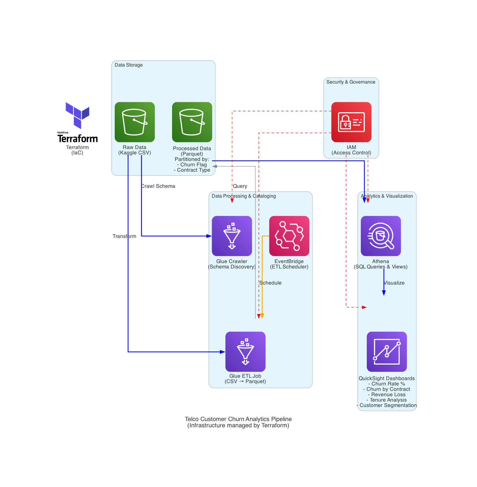

# AWS Data Analytics Pipeline — Telco Customer Churn

This project builds a **serverless data analytics pipeline** on AWS to analyze customer churn using the **Telco Customer Churn dataset** from [Kaggle](https://www.kaggle.com/datasets/blastchar/telco-customer-churn). The system ingests raw data, processes it into an analytics-friendly format, and enables SQL queries and dashboards to gain insights.

---

## Architecture

* **Amazon S3** – stores raw CSV input and processed Parquet output
* **AWS Glue** – crawler to catalog schemas and optional ETL job for Parquet conversion
* **Amazon Athena** – SQL queries and views for churn KPIs
* **Amazon QuickSight** – dashboards for visualizing churn insights
* **Amazon EventBridge (optional)** – schedule Glue ETL jobs
* **Terraform** – Infrastructure as Code for reproducible setup

  
---

## Demo

https://www.loom.com/share/410b4ecedb664fc9bb0976f37f07032e?sid=b1e67724-c986-4a87-9274-fd314052f2f2

---

## Blog Post

For a deeper dive into the challenges faced and design decisions, see the blog post here:
👉 [Blog post link coming soon]()
